# Yolo-v8-Guitar-Detection-Demo-Colab

Train your own Guitar Detection using Yolo V8 and Colaboratory!

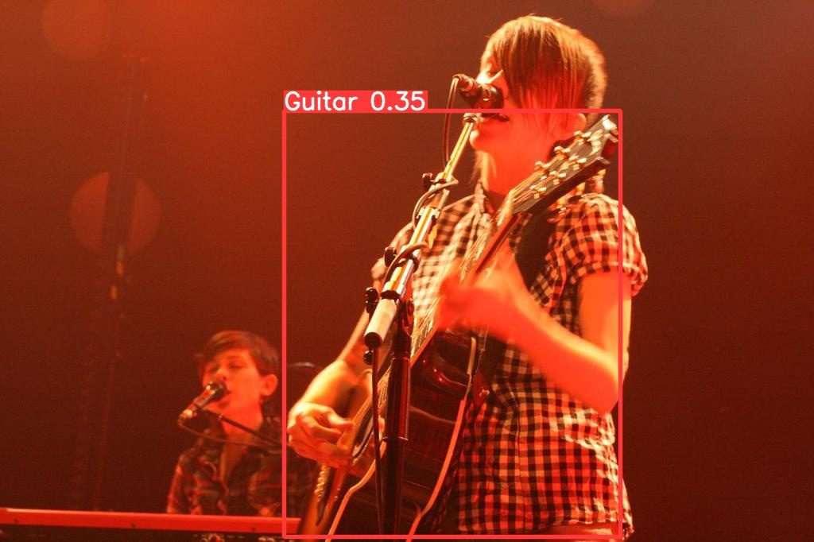 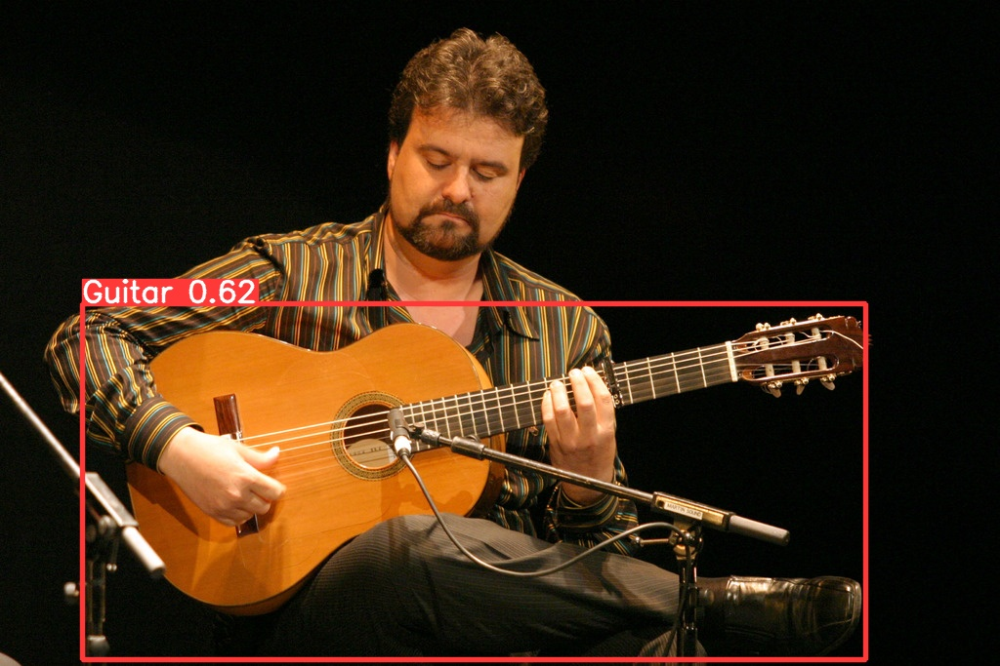

## What is YOLO?

**You only look once (YOLO)** is a state-of-the-art, real-time object detection system. From the maker's own words, *"YOLOv8 is designed to be fast, accurate, and easy to use, making it an excellent choice for a wide range of object detection and tracking, instance segmentation, image classification and pose estimation tasks."* Released in January 2023, it claims to be faster and more accurate than the already widely-used YOLOv5. Let's try it out using a custom dataset (I like guitars but you can choose your own!) and leveraging the powerful and most importantly ***free*** GPUs of Google Colaboratory.

## Obtaining images for your dataset

There are many ways to do this, but for our case I we could use the [OIDV4 Toolkit](https://github.com/EscVM/OIDv4_ToolKit) to help us download images from Google's [Open Image Dataset](https://storage.googleapis.com/openimages/web/index.html). Instead of using the labels already available we will annotate the images ourselves.

- Clone the [OIDV4 repository](https://github.com/EscVM/OIDv4_ToolKit)

```py
git clone https://github.com/EscVM/OIDv4_ToolKit.git
```

- Install the required packages

```py
pip3 install -r requirements.txt
```

- Run this command to download 500 guitar images, subdivided into test/train/validation folders

```py
python3 main.py downloader --classes Guitar --type_csv all -y --limit 500 --noLabels
```

## Annotate images using Roboflow

Now that we have the unlabelled images, we will need to annotate them by drawing bounded boxes on the guitars. [Roboflow](https://roboflow.com/) is a great Computer Vision workflow service we can use for free to easily annotate and prepare our dataset.

- Create an account and a new Workspace on [Roboflow](https://roboflow.com/)
- Create a Project and upload some images for annotation. I used 60 images in total (45 train/15 test), and it takes a while to annotate all of them so don't do too many. Of course you may improve the performance of the model should you choose to use more images.
- Annotate the images.
  - You can draw rectangular bounding boxes on the guitars or use the 'Smart Polygon' feature Roboflow provides to draw more 'contoured' bounds. I went with the rectangular ones for now
    - Make use of the left/right arrow keys and the 'Enter' key during annotation - yes, it is very tedious xD

## Generate the Dataset

After annotating all the images (good work!), you can move on by clicking 'Generate New Version' of the dataset. There are some options like 'Preprocessing', which I did include. After generation, you can grab the code to download the dataset from the 'Get Snippet' button under 'Custom Train'. You will need to paste this code snippet into the Colaboratory notebook to directly download the images into your google drive. Start by copying the [notebook](./yolov8_guitar.ipynb) into Google Colaboratory, make sure you enable the GPU, and then follow the notebook until the end!

## Training the model

After generating the dataset, continue running the cells until you reach the model training. You can leave all the cells as default to see how it runs first. After the set epochs, it will save the best trained model's weights into the final model. Enter that number to use those weights for our testing step next

## Model statistics and sample validation

After that we can print out the confusion matrix, model results, and sample validation results:
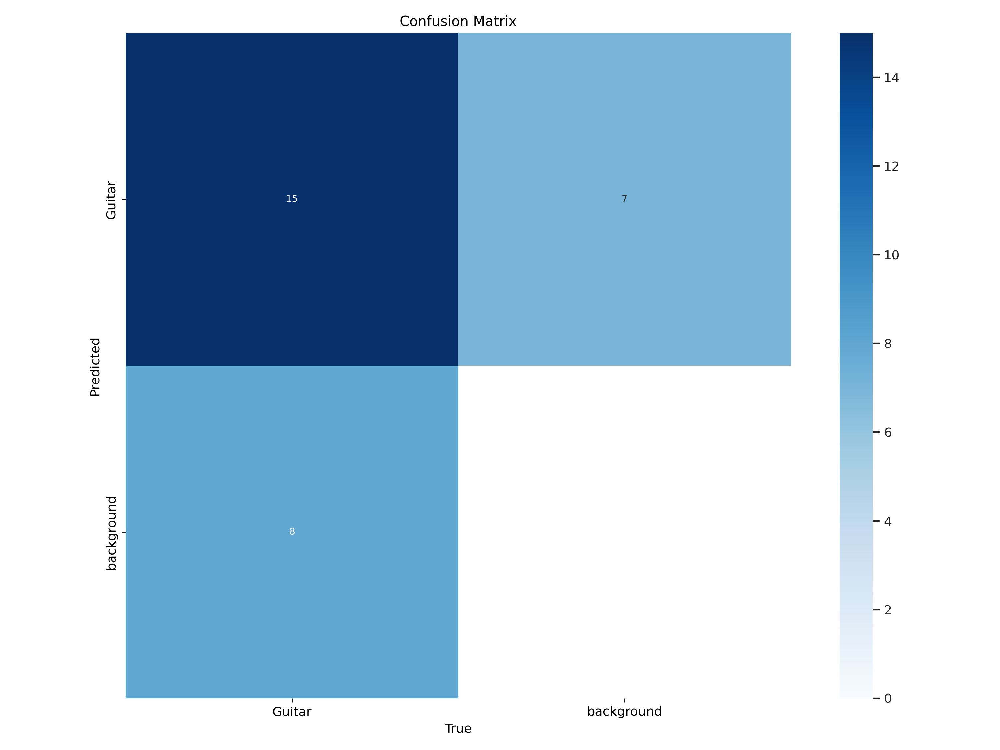
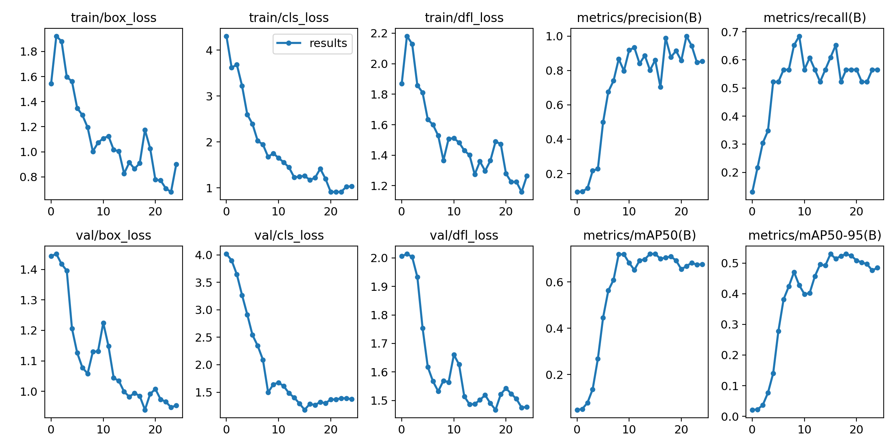
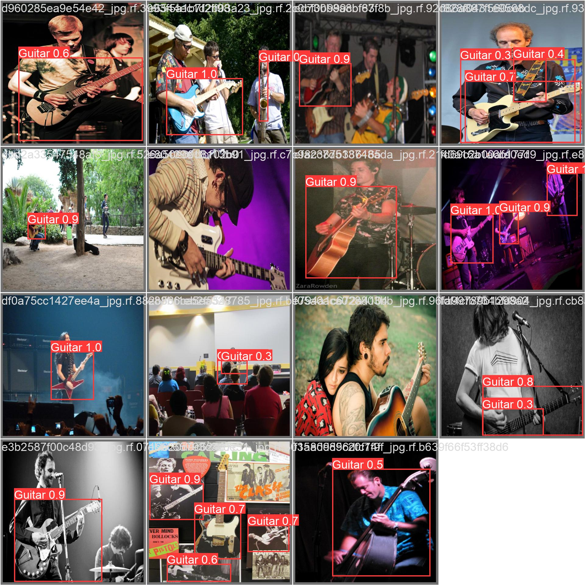
Well, it does seem to be detecting most guitars, at least! Considering our small dataset and very short training time, I think it's done pretty well. Let's test the model with some of the images we downloaded earlier.

## Sample Test results

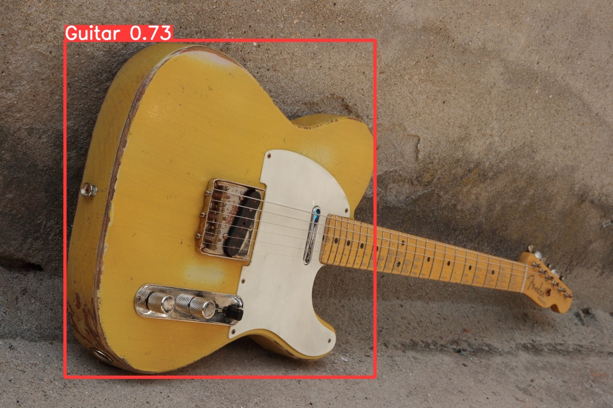
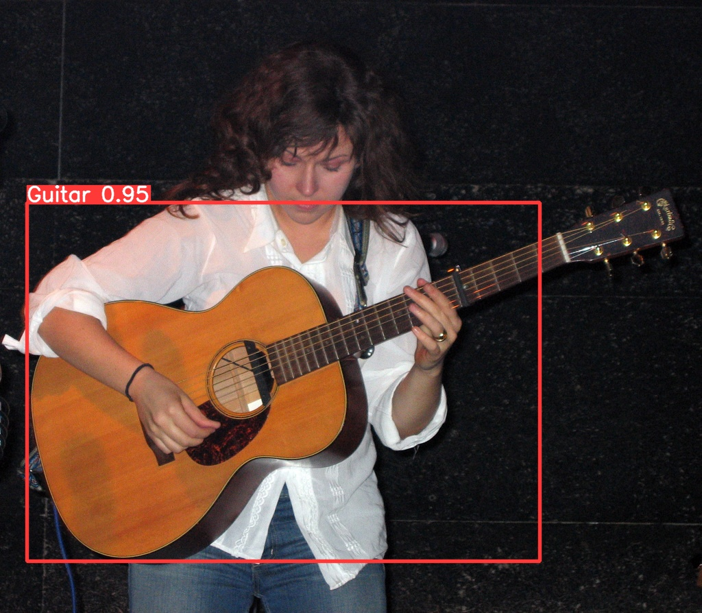
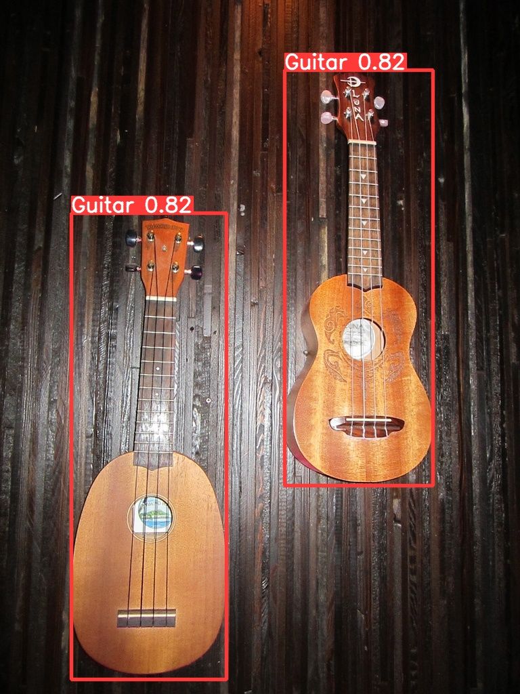
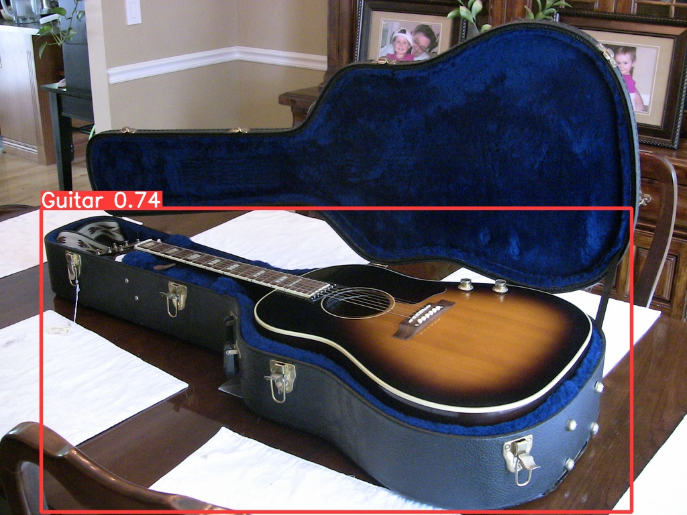
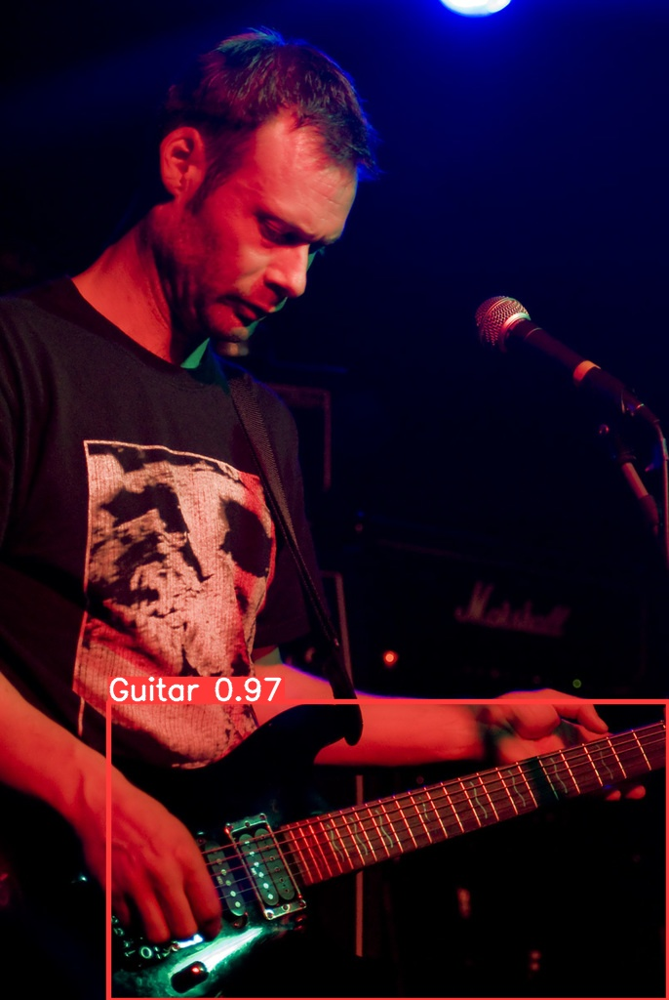
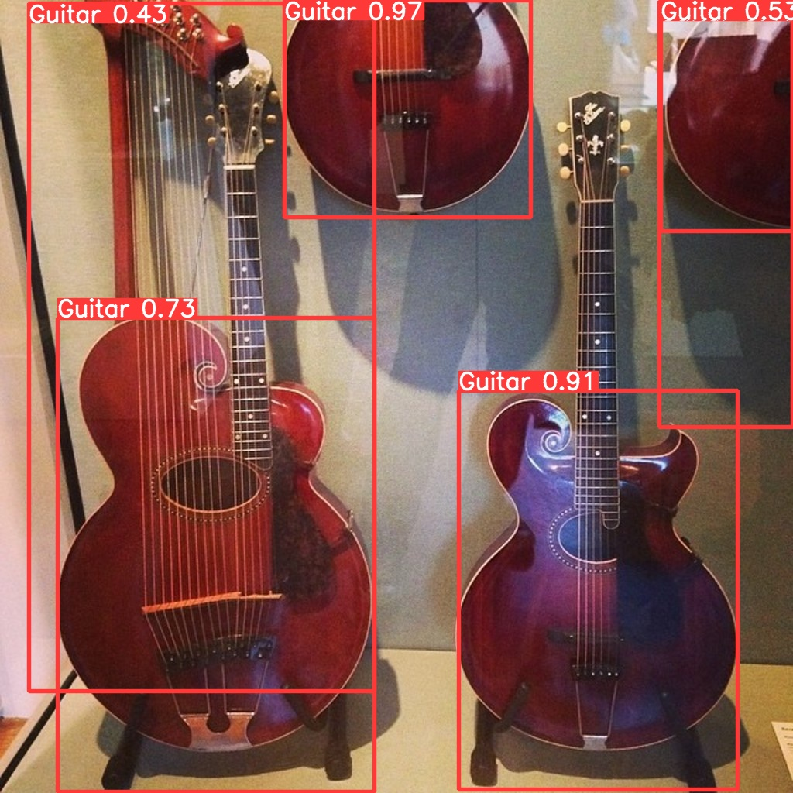
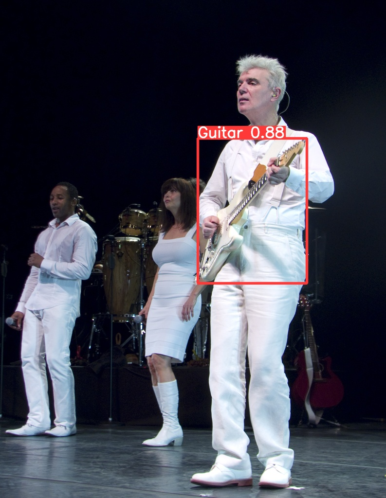
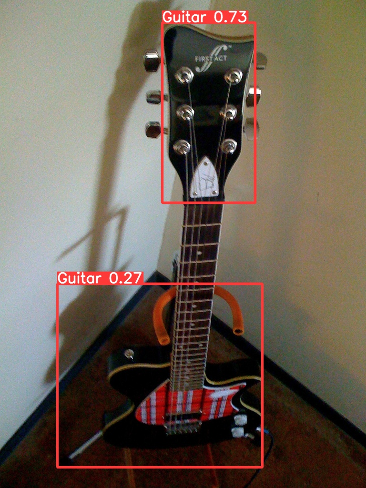

As seen above, it seems to be able to detect and capture most guitars, but note that the last picture fooled the detector a bit due to its orientation. We can check the training set and see that it had very little opportunity to learn this angle and orientation properly, and increasing the training set size would definitely help in those cases.

## How to improve the model

There are more than a couple ways to can improve the model performance. Some include:

- Increasing the number of images used to train the model
- Increasing the variety of images used to train the model for better detection of the object in different orientations
- Increasing the training time (more epochs)
- Changing the model size of Yolo v8 used (larger model = better accuracy but possibly lower speed)
- Follow the latest research and developments on arxiv.org (e.g. [this paper](https://www.preprints.org/manuscript/202212.0049/v2/download) successfully used transfer learning like we are attempting, but on drones)

## Conclusion

Now it's your turn to create a detector for your favourite kind of thing! Remember to leave a star or comment and share your own tips and findings with the community.

## Acknowledgments

This workflow and a lot of the code was inspired by [Sarganil Das's notebook](https://github.com/sagarnildass/Guitar-Detection-YOLO-V8), although I added the Colaboratory part since *Freedom is free*. Be sure to check out how he does it too.
